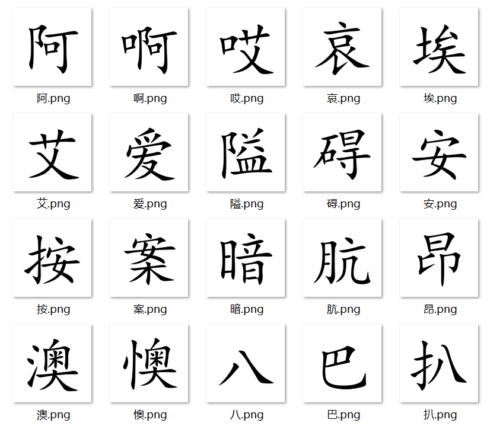
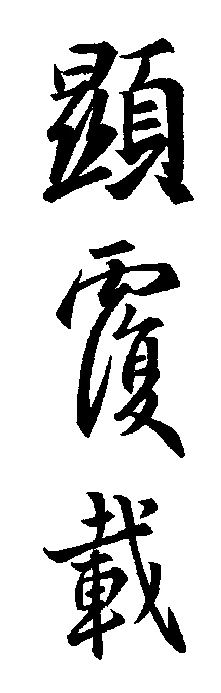
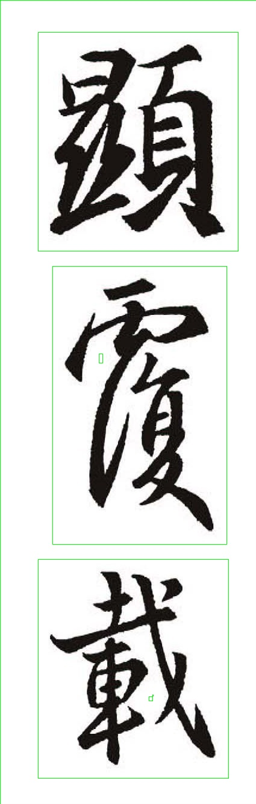
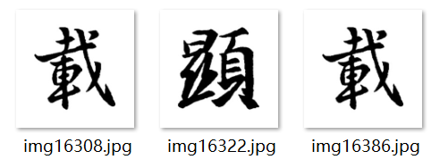

# FontClean
汉字图像数据清洗工具，两个功能：字体文件转汉字图像，书法作品文字分割

因为毕设相关，需要数据集，所以写了两个工具
## 字体文件转汉字图像
### 目录
```bash
├─data           //存放生成数据
├─fonts          //字体文件放在这
|  Font2Img.py   //运行脚本
```
示例代码为将生成楷体汉字图像



## 书法作品文字分割
### 目录
```bash
├─CleanData         //存放生成数据
├─OriginData        //书法作品图像
|  ShuFa2Img.py     //运行脚本
```
示例：
输入


加深


分割


保存


